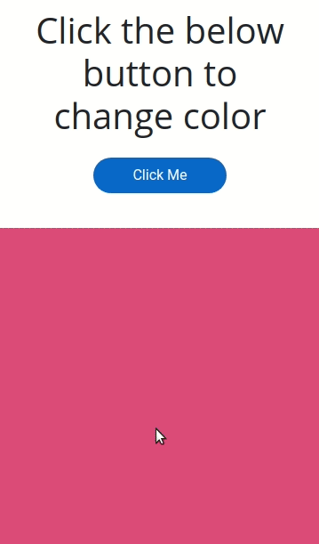

## Random Color Generator

In this project, let's build a Random Color Generator.

- Refer to the below image.

    - 

**Resources**
- CSS Colors used:

- The background color Hex Code Values are given below.

    - #e75d7c
    - #b16cef
    - #53cca4
    - #efc84d
    - #628ef0
    - #184b73
    - #883e7f
    - #ed048b
