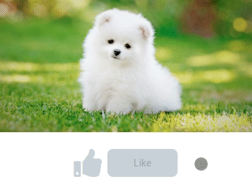

## Toggle Like and Unlike

In this project, let's build a Toggle Like and Unlike.

**Refer to the below image.**

 -

**Resources**
*Use the image URLs given below.*

 - https://d1tgh8fmlzexmh.cloudfront.net/ccbp-dynamic-webapps/white-puppy-img.png

 - https://d1tgh8fmlzexmh.cloudfront.net/ccbp-dynamic-webapps/white-puppy-liked-img.png
 
 - CSS Colors used:

    - #cbd2d9
    - #9aa5b1
    - #0967d2